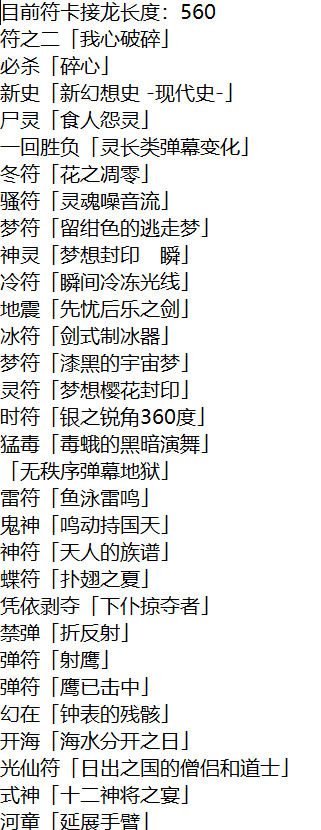

# 东方符卡中文接龙

## 结果

## 目的

有成语接龙，想看一看有没有东方的符卡接龙。如果符卡也能玩接龙，那就看看最长能接多少张符卡。

## 问题以及解决方法

符卡名取自THBwiki上的中文翻译，符卡名不包含日文，有部分符卡英文部分没有翻译，那么如果符卡名以英文结尾，则符卡最后一个发音取最后一个字母的发音。这就是说，是符卡中文翻译的拼音接龙。。。

因为成语接龙中的成语不能重复出现，所以找最长符卡接龙，就是在，存在平行边和环的有向图中找不重叠最长路径。

这个问题我没找到多项式时间的算法，于是用了递归解决。奈何符卡太多，机器跑了半天也不见停。。所以跑了几次，上传了一次最长的。

## 后记

没想到东方的符卡这么多。。大概1500多张，如果其中一大部分都有相应的弹幕的话，zun真是在奇怪的地方做了不得了的事情。。